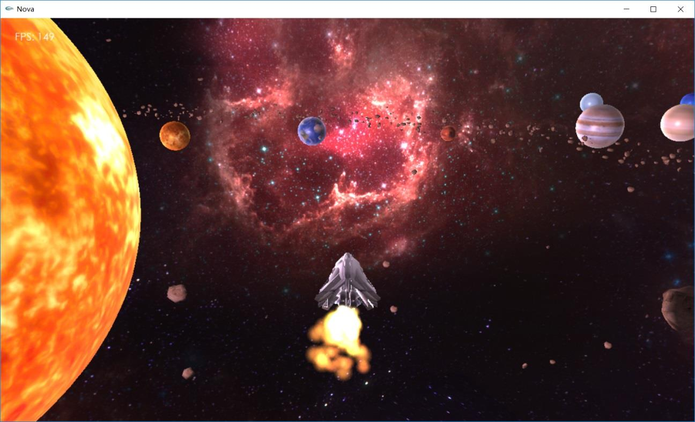
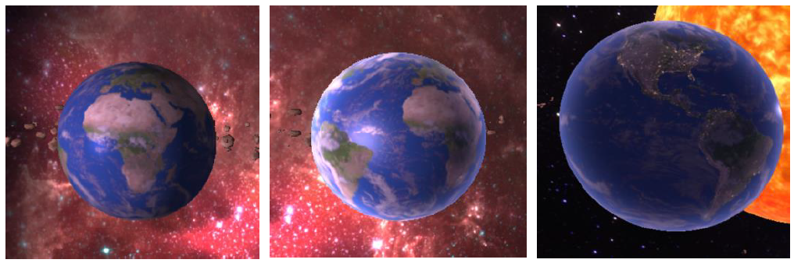
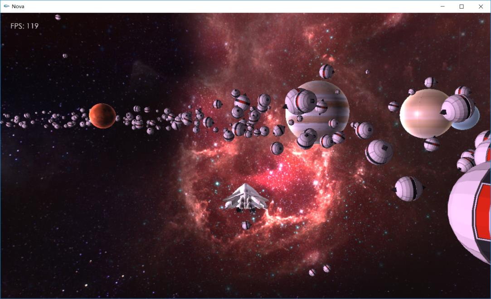

# Nova

**Nova** is a solar system simulator build with **C++** and **OpenGL**. Various types of objects are simulated in this program, such as Skybox, Sun(Lightsource), Planets, Asteroids(Particle Effects), and spaceship.

Several techniques and libraries are used in this program: 

* **Core-profile Mode** and **Instanced Rendering** are used to achieve better performance
* `Assimp` library for loading model
* `Stb_image` library for loading texture
* `Freetype` for font rendering

## Screenshots

* Custom shader

* Self-made model: Evil robot

